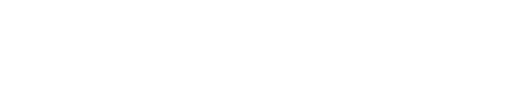
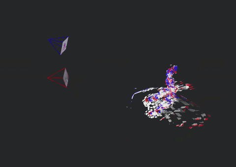
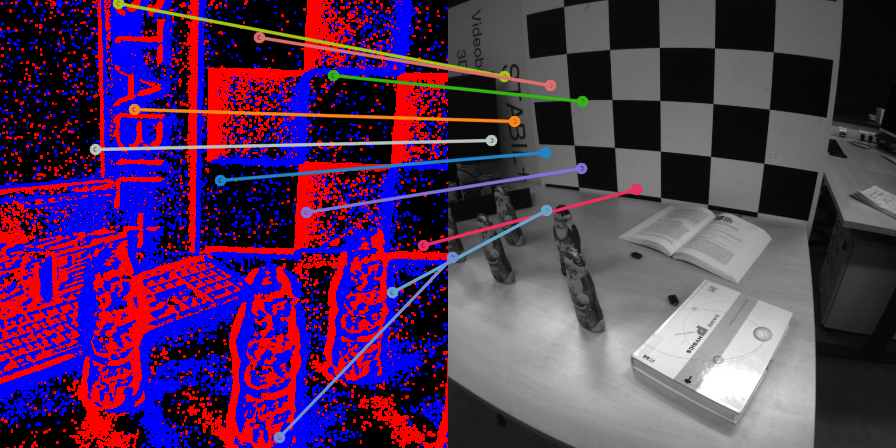

<a name="readme-top"></a>

<div align="center" style="background-color: #0e2841; padding: 20px; border-radius: 15px; margin-bottom: 20px;">
  
  <h1 style="color: #ffffff; margin-top: 20px;">RGB and Event Aligned Latent Manifold</h1>
</div>

Welcome to **REALM**! This repository contains the implementation of REALM, for advanced computer vision tasks involving both traditional RGB and Event-based vision.
If you use this code, please cite the following publication:

<div align="center">
    
</div>

```bibtex
@misc{polizzi_2026_realm,
      title={REALM: RGB and Event Aligned Latent Manifold}, 
      author={Vincenzo Polizzi and David B. Lindell and Jonathan Kelly},
      year={2026},
      eprint={},
      archivePrefix={arXiv},
      primaryClass={cs.CV},
      url={https://arxiv.org/abs/}, 
}
```
---

## Abstract

Event cameras provide several unique advantages over standard frame-based sensors, including high temporal resolution, low latency, and robustness to extreme lighting. However, existing learning-based approaches for event processing are typically confined to narrow, task-specific silos and lack the ability to generalize across modalities. 

We address this gap with **REALM**, a cross-modal framework that learns an **R**GB and **E**vent **A**ligned **L**atent **M**anifold by projecting event representations into the pretrained latent space of RGB foundation models. Instead of task-specific training, we leverage low-rank adaptation (LoRA) to bridge the modality gap, effectively unlocking the geometric and semantic priors of frozen RGB backbones for asynchronous event streams.

We demonstrate that **REALM** effectively maps events into the ViT-based foundation latent space. Our method allows us to perform downstream tasks like depth estimation and semantic segmentation by simply transferring linear heads trained on the RGB teacher. Most significantly, **REALM** enables the direct, zero-shot application of complex, frozen image-trained decoders, such as MASt3R, to raw event data. We demonstrate state-of-the-art performance in wide-baseline feature matching, significantly outperforming specialized architectures. Code and models are available upon acceptance.

<p align="right">(<a href="#readme-top">back to top</a>)</p>

---

## 🚀 Features

- **Multi-Modal Matching**: 3D grounded matching pipelines for RGB-to-Event and Event-to-Event.
- **Advanced Architectures**: Seamlessly integrates RGB trained heads using [DUNE backbone](https://github.com/naver/dune).
- **Multiple Downstream Tasks**: Support for depth estimation, semantic segmentation, 3D reconstruction and matching.
- **Comprehensive Evaluation**: Extensive benchmarking and evaluation scripts.

## 🛠️ Installation

We highly recommend using Conda to manage your python environment. Follow the steps below to install all dependencies and the `realm` package.

### 1. Create a Conda Environment

Create and activate a new Conda environment (we recommend Python 3.10+):

```bash
conda create -n realm python=3.10 -y
conda activate realm
conda install -y -c "nvidia/label/cuda-12.8.0" cuda-toolkit
```

Check that the nvcc compiler is available and the CUDA version is 12.8:

```bash
nvcc --version # should show CUDA 12.8
```

### 2. Install Requirements

Install the dependencies from the `requirements.txt` file located at the root of the repository:

```bash
pip install -r requirements.txt
```

### 3. Install the REALM Package

Navigate into the `realm` directory and install the core package:

```bash
cd realm
pip install .
```

<p align="right">(<a href="#readme-top">back to top</a>)</p>

---

## 💡 Usage

### 1. Import and Use REALM in Your Code

After installation, you can import the REALM package in your Python code as follows:

```python
import torch
from realm import REALM_creator
from realm.utils import representation_factory
from realm.utils import Resize


# Initialize the REALM model
# see realm/realm/configs/ for example configurations
model = REALM_creator(config='path/to/config.yaml') 

# Random event generation assuming a camera resolution of 720p and 5 channels (e.g., x, y, timestamp, polarity, and one additional feature channel)
H, W = 720, 1280

# random x, y, timestamp, polarity
x = torch.randint(0, W, (1000,))  # x-coordinates of events
y = torch.randint(0, H, (1000,))  # y-coordinates of events
timestamp = torch.rand(1000) * 1e6  # timestamps in microseconds
polarity = torch.randint(0, 2, (1000,))  # polarity: 0 for negative events, 1 for positive events

# Create an event representation using the factory function
channels = 5
normalize = True  # Whether to normalize the input data
ev_repr = representation_factory(
    rep_type="voxel_grid", height=H, width=W,
    channels=channels, normalize=normalize,
)

# Example input (replace with actual data)
input_data = ev_repr(x, y, timestamp, polarity)  # shape: (C, H, W) where C is the number of channels

# resize to 448x448 for REALM input
resize = Resize((448, 448))
input_data = resize(input_data)  # shape: (C, 448, 448)

# Forward pass through the model
output = model(input_data.unsqueeze(0), {optional_options})  # Add batch dimension, shape: (1, C, H, W)
```

### 2. Running Evaluation Scripts

The `evaluation/` directory contains scripts for evaluating the performance of REALM on various tasks. You can run these scripts as follows:

```bash
python evaluation/evaluate_depth.py
python evaluation/evaluate_segmentation.py
python evaluation/evaluate_matching.py
```

To store the visualization of the results, pass the `--save-visuals` flag, results will be saved under `results/`.

To run a quick feature matching test between some events and an RGB image, run the following script:


```bash
python realm/realm/model_factory.py
```

Expect to see the following image under `test/`:
<div align="center">
    
</div>

<p align="right">(<a href="#readme-top">back to top</a>)</p>

---

## 📝 License

This project is licensed under the [Creative Commons Attribution-NonCommercial-ShareAlike 4.0 International License](https://creativecommons.org/licenses/by-nc-sa/4.0/).

[](https://creativecommons.org/licenses/by-nc-sa/4.0/)

You are free to share and adapt this material for **non-commercial purposes**, provided that you:

- give appropriate credit and cite the REALM paper,
- indicate if changes were made,
- distribute any derivative work under the same license.

© 2025 Space and Terrestrial Autonomous Robotic Systems (STARS) Lab, University of Toronto Institute for Aerospace Studies (UTIAS). All rights reserved.

### Third-party Components

The following components are included in this repository under their own respective licenses:

- **[DUSt3R](https://github.com/naver/dust3r)** (`thirdparty/dust3r/`) — please refer to the original repository for license details.
- **MASt3R head** (`heads/mast3r/`) — modified from [MASt3R](https://github.com/naver/mast3r); please refer to the original repository for license details.
- **[DUNE](https://github.com/naver/dune)** (`dune/`) — please refer to the original repository for license details.

Please ensure you comply with the respective licenses of these components when using or redistributing this software.

<p align="right">(<a href="#readme-top">back to top</a>)</p>

## 🙏 Acknowledgements

This code is based on some open-source repositories, including:
- [DUNE](https://github.com/naver/dune)
- [MASt3R](https://github.com/naver/mast3r)
- [DUSt3R](https://github.com/naver/dust3r)
- The work by the [Robotics and Perception Group](https://rpg.ifi.uzh.ch/) at the University of Zurich for the event-based vision datasets and evaluation scripts that make it possible to benchmark the performance of REALM on downstream tasks.

<p align="right">(<a href="#readme-top">back to top</a>)</p>